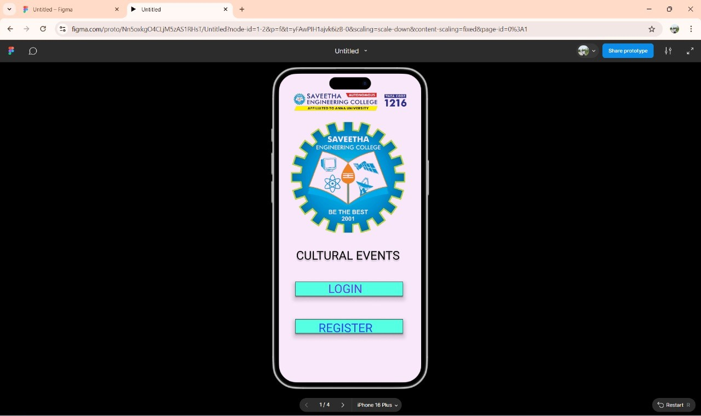

# Ex09 Event Registration Web Application
# Date:12-05-2025
# AIM:
To design, develop and deploy a web application for event registration.

# DESIGN STEPS:
## Step 1:
Create a new frame.

## Step 2:
Select any one preset size of your choice.

## Step 3:
Select the shapes you need.

## Step 4:
Import images as needed.

## Step 5:
Create pages based on your need and link them.

## Step 6:
Validate the HTML and CSS code.

## Step 6:
Publish the website in the given URL.

# DESIGN TOOL:
Figma

# CODE:
```
Home page-1
<div class="container--0-">
  
  <svg
    width="361"
    height="79"
    viewBox="0 0 361 79"
    fill="none"
    xmlns="http://www.w3.org/2000/svg"
  >
    <g filter="url(#filter0_dd_1_71)">
      <rect x="18" y="10" width="325" height="43" fill="#54FFE2"></rect>
      <rect x="18.5" y="10.5" width="324" height="42" stroke="black"></rect>
    </g>
    <defs>
      <filter
        id="filter0_dd_1_71"
        x="0"
        y="0"
        width="361"
        height="79"
        filterUnits="userSpaceOnUse"
        color-interpolation-filters="sRGB"
      >
        <feFlood flood-opacity="0" result="BackgroundImageFix"></feFlood>
        <feColorMatrix
          in="SourceAlpha"
          type="matrix"
          values="0 0 0 0 0 0 0 0 0 0 0 0 0 0 0 0 0 0 127 0"
          result="hardAlpha"
        ></feColorMatrix>
        <feOffset dy="4"></feOffset>
        <feGaussianBlur stdDeviation="2"></feGaussianBlur>
        <feColorMatrix
          type="matrix"
          values="0 0 0 0 0 0 0 0 0 0 0 0 0 0 0 0 0 0 0.3 0"
        ></feColorMatrix>
        <feBlend
          mode="normal"
          in2="BackgroundImageFix"
          result="effect1_dropShadow_1_71"
        ></feBlend>
        <feColorMatrix
          in="SourceAlpha"
          type="matrix"
          values="0 0 0 0 0 0 0 0 0 0 0 0 0 0 0 0 0 0 127 0"
          result="hardAlpha"
        ></feColorMatrix>
        <feMorphology
          radius="6"
          operator="dilate"
          in="SourceAlpha"
          result="effect2_dropShadow_1_71"
        ></feMorphology>
        <feOffset dy="8"></feOffset>
        <feGaussianBlur stdDeviation="6"></feGaussianBlur>
        <feColorMatrix
          type="matrix"
          values="0 0 0 0 0 0 0 0 0 0 0 0 0 0 0 0 0 0 0.15 0"
        ></feColorMatrix>
        <feBlend
          mode="normal"
          in2="effect1_dropShadow_1_71"
          result="effect2_dropShadow_1_71"
        ></feBlend>
        <feBlend
          mode="normal"
          in="SourceGraphic"
          in2="effect2_dropShadow_1_71"
          result="shape"
        ></feBlend>
      </filter>
    </defs></svg>
    <svg>
    width="361"
    height="79"
    viewBox="0 0 361 79"
    fill="none"
    xmlns="http://www.w3.org/2000/svg"
  >
    <g filter="url(#filter0_dd_1_80)">
      <rect x="18" y="10" width="325" height="43" fill="#54FFE2"></rect>
      <rect x="18.5" y="10.5" width="324" height="42" stroke="black"></rect>
    </g>
    <defs>
      <filter
        id="filter0_dd_1_80"
        x="0"
        y="0"
        width="361"
        height="79"
        filterUnits="userSpaceOnUse"
        color-interpolation-filters="sRGB"
      >
        <feFlood flood-opacity="0" result="BackgroundImageFix"></feFlood>
        <feColorMatrix
          in="SourceAlpha"
          type="matrix"
          values="0 0 0 0 0 0 0 0 0 0 0 0 0 0 0 0 0 0 127 0"
          result="hardAlpha"
        ></feColorMatrix>
        <feOffset dy="4"></feOffset>
        <feGaussianBlur stdDeviation="2"></feGaussianBlur>
        <feColorMatrix
          type="matrix"
          values="0 0 0 0 0 0 0 0 0 0 0 0 0 0 0 0 0 0 0.3 0"
        ></feColorMatrix>
        <feBlend
          mode="normal"
          in2="BackgroundImageFix"
          result="effect1_dropShadow_1_80"
        ></feBlend>
        <feColorMatrix
          in="SourceAlpha"
          type="matrix"
          values="0 0 0 0 0 0 0 0 0 0 0 0 0 0 0 0 0 0 127 0"
          result="hardAlpha"
        ></feColorMatrix>
        <feMorphology
          radius="6"
          operator="dilate"
          in="SourceAlpha"
          result="effect2_dropShadow_1_80"
        ></feMorphology>
        <feOffset dy="8"></feOffset>
        <feGaussianBlur stdDeviation="6"></feGaussianBlur>
        <feColorMatrix
          type="matrix"
          values="0 0 0 0 0 0 0 0 0 0 0 0 0 0 0 0 0 0 0.15 0"
        ></feColorMatrix>
        <feBlend
          mode="normal"
          in2="effect1_dropShadow_1_80"
          result="effect2_dropShadow_1_80"
        ></feBlend>
        <feBlend
          mode="normal"
          in="SourceGraphic"
          in2="effect2_dropShadow_1_80"
          result="shape"
        ></feBlend>
      </filter>
    </defs>
  </svg>
  <div class="text-0-1-4"></div>
  <div class="text-0-1-5">LOGIN</div>
  <div class="text-0-1-6">REGISTER</div>
  <div class="text-0-1-7">CULTURAL EVENTS</div>
</div>
// css for homepage-1
.container--0- {
  position: absolute;
  left: 282px;
  top: -483px;
  width: 429px;
  height: 952px;
  background-color: #f9e7fa;
  justify-content: start;
  align-items: start;
}
.text-0-1-4 {
  width: 326px;
  height: 36px;
  color: #000000;
  font-size: 36px;
  font-family: Roboto, "Regular";
  font-weight: 400;
  text-align: left;
  vertical-align: top;
}
.text-0-1-5 {
  width: 325px;
  height: 35px;
  color: #6a40e0;
  font-size: 36px;
  font-family: Roboto, "Regular";
  font-weight: 400;
  text-align: left;
  vertical-align: top;
}
.text-0-1-6 {
  width: 326px;
  height: 38px;
  font-size: 36px;
  font-family: Roboto, "Regular";
  font-weight: 400;
  text-align: left;
  vertical-align: top;
}
.text-0-1-7 {
  width: 329px;
  height: 54px;
  color: #000000;
  border-width: 1px;
  border-style: solid;
  border-color: #000000;
  box-shadow: 0px 4px 4px 0 #000000;
  font-size: 36px;
  font-family: Roboto, "Regular";
  font-weight: 400;
  text-align: left;
  vertical-align: top;
}
page-2
<div class="container--0-">
 <svg
    width="30"
    height="31"
    viewBox="0 0 30 31"
    fill="none"
    xmlns="http://www.w3.org/2000/svg"
  >
    <path
      d="M15 0L18.3677 11.7467L29.2658 11.7467L20.4491 19.0066L23.8168 30.7533L15 23.4934L6.18322 30.7533L9.55093 19.0066L0.734152 11.7467L11.6323 11.7467L15 0Z"
      fill="#161313"
    ></path>
  </svg>
  <div class="text-0-1-2">SINGING<br /></div>
  <svg
    width="30"
    height="31"
    viewBox="0 0 30 31"
    fill="none"
    xmlns="http://www.w3.org/2000/svg"
  >
    <path
      d="M15 0L18.3677 11.7467L29.2658 11.7467L20.4491 19.0066L23.8168 30.7533L15 23.4934L6.18322 30.7533L9.55093 19.0066L0.734152 11.7467L11.6323 11.7467L15 0Z"
      fill="#221E1E"
    ></path></svg
  ><svg
    width="30"
    height="31"
    viewBox="0 0 30 31"
    fill="none"
    xmlns="http://www.w3.org/2000/svg"
  >
    <path
      d="M15 0L18.3677 11.7467L29.2658 11.7467L20.4491 19.0066L23.8168 30.7533L15 23.4934L6.18322 30.7533L9.55093 19.0066L0.734152 11.7467L11.6323 11.7467L15 0Z"
      fill="#221B1B"
    ></path>
  </svg>
  <div class="text-0-1-5">CULTURAL EVENTS<br /><br /></div>
  <div class="text-0-1-6">DANCING</div>
  <div class="text-0-1-7">PAINTING</div>
  <svg
    width="30"
    height="31"
    viewBox="0 0 30 31"
    fill="none"
    xmlns="http://www.w3.org/2000/svg"
  >
    <path
      d="M15 0L18.3677 11.7467L29.2658 11.7467L20.4491 19.0066L23.8168 30.7533L15 23.4934L6.18322 30.7533L9.55093 19.0066L0.734152 11.7467L11.6323 11.7467L15 0Z"
      fill="#151313"
    ></path>
  </svg>
  <div class="text-0-1-9">RAMP WALK</div>
  <svg
    width="30"
    height="31"
    viewBox="0 0 30 31"
    fill="none"
    xmlns="http://www.w3.org/2000/svg"
  >
    <path
      d="M15 0L18.3677 11.7467L29.2658 11.7467L20.4491 19.0066L23.8168 30.7533L15 23.4934L6.18322 30.7533L9.55093 19.0066L0.734152 11.7467L11.6323 11.7467L15 0Z"
      fill="#131111"
    ></path>
  </svg>
  <div class="text-0-1-11">FASHION SHOW</div>
  <svg
    width="30"
    height="31"
    viewBox="0 0 30 31"
    fill="none"
    xmlns="http://www.w3.org/2000/svg"
  >
    <path
      d="M15 0L18.3677 11.7467L29.2658 11.7467L20.4491 19.0066L23.8168 30.7533L15 23.4934L6.18322 30.7533L9.55093 19.0066L0.734152 11.7467L11.6323 11.7467L15 0Z"
      fill="#221F1F"
    ></path>
  </svg>
  <div class="text-0-1-13">LIVE CONCERT</div>
</div>
// css for page-2
.container--0- {
  position: absolute;
  left: 742px;
  top: -483px;
  width: 430px;
  height: 952px;
  background-color: #f6e8f4;
  justify-content: start;
  align-items: start;
}
.text-0-1-2 {
  width: 287px;
  height: 63px;
  color: #0c676f;
  font-size: 36px;
  font-family: Roboto, "Regular";
  font-weight: 400;
  text-align: left;
  vertical-align: top;
}
.text-0-1-5 {
  width: 331px;
  height: 87px;
  color: #c014a3;
  border-width: 1px;
  border-style: solid;
  border-color: #000000;
  backdrop-filter: blur(4px);
  font-size: 36px;
  font-family: Roboto, "Regular";
  font-weight: 400;
  text-align: left;
  vertical-align: top;
}
.text-0-1-6 {
  width: 211px;
  height: 44px;
  color: #0d756b;
  font-size: 36px;
  font-family: Roboto, "Regular";
  font-weight: 400;
  text-align: left;
  vertical-align: top;
}
.text-0-1-7 {
  width: 244px;
  height: 49px;
  color: #0b616e;
  font-size: 36px;
  font-family: Roboto, "Regular";
  font-weight: 400;
  text-align: left;
  vertical-align: top;
}
.text-0-1-9 {
  width: 219px;
  height: 50px;
  color: #0e6475;
  font-size: 36px;
  font-family: Roboto, "Regular";
  font-weight: 400;
  text-align: left;
  vertical-align: top;
}
.text-0-1-11 {
  width: 319px;
  height: 37px;
  color: #096e70;
  font-size: 36px;
  font-family: Roboto, "Regular";
  font-weight: 400;
  text-align: left;
  vertical-align: top;
}
.text-0-1-13 {
  width: 298px;
  height: 44px;
  color: #0e5c5a;
  font-size: 36px;
  font-family: Roboto, "Regular";
  font-weight: 400;
  text-align: left;
  vertical-align: top;
}
page-3

<div class="container--0-">
  <div class="text-0-1-1">REGISTRATION FORM</div>
  <svg
    width="321"
    height="49"
    viewBox="0 0 321 49"
    fill="none"
    xmlns="http://www.w3.org/2000/svg"
  >
    <g filter="url(#filter0_d_9_33)">
      <rect x="4" width="313" height="41" fill="#F3D3D3"></rect>
    </g>
    <defs>
      <filter
        id="filter0_d_9_33"
        x="0"
        y="0"
        width="321"
        height="49"
        filterUnits="userSpaceOnUse"
        color-interpolation-filters="sRGB"
      >
        <feFlood flood-opacity="0" result="BackgroundImageFix"></feFlood>
        <feColorMatrix
          in="SourceAlpha"
          type="matrix"
          values="0 0 0 0 0 0 0 0 0 0 0 0 0 0 0 0 0 0 127 0"
          result="hardAlpha"
        ></feColorMatrix>
        <feOffset dy="4"></feOffset>
        <feGaussianBlur stdDeviation="2"></feGaussianBlur>
        <feComposite in2="hardAlpha" operator="out"></feComposite>
        <feColorMatrix
          type="matrix"
          values="0 0 0 0 0 0 0 0 0 0 0 0 0 0 0 0 0 0 0.25 0"
        ></feColorMatrix>
        <feBlend
          mode="normal"
          in2="BackgroundImageFix"
          result="effect1_dropShadow_9_33"
        ></feBlend>
        <feBlend
          mode="normal"
          in="SourceGraphic"
          in2="effect1_dropShadow_9_33"
          result="shape"
        ></feBlend>
      </filter>
    </defs></svg
  ><svg
    width="321"
    height="49"
    viewBox="0 0 321 49"
    fill="none"
    xmlns="http://www.w3.org/2000/svg"
  >
    <g filter="url(#filter0_d_9_34)">
      <path d="M4 0H317V41H4V0Z" fill="#EFCCCC"></path>
    </g>
    <defs>
      <filter
        id="filter0_d_9_34"
        x="0"
        y="0"
        width="321"
        height="49"
        filterUnits="userSpaceOnUse"
        color-interpolation-filters="sRGB"
      >
        <feFlood flood-opacity="0" result="BackgroundImageFix"></feFlood>
        <feColorMatrix
          in="SourceAlpha"
          type="matrix"
          values="0 0 0 0 0 0 0 0 0 0 0 0 0 0 0 0 0 0 127 0"
          result="hardAlpha"
        ></feColorMatrix>
        <feOffset dy="4"></feOffset>
        <feGaussianBlur stdDeviation="2"></feGaussianBlur>
        <feComposite in2="hardAlpha" operator="out"></feComposite>
        <feColorMatrix
          type="matrix"
          values="0 0 0 0 0 0 0 0 0 0 0 0 0 0 0 0 0 0 0.25 0"
        ></feColorMatrix>
        <feBlend
          mode="normal"
          in2="BackgroundImageFix"
          result="effect1_dropShadow_9_34"
        ></feBlend>
        <feBlend
          mode="normal"
          in="SourceGraphic"
          in2="effect1_dropShadow_9_34"
          result="shape"
        ></feBlend>
      </filter>
    </defs></svg
  ><svg
    width="321"
    height="49"
    viewBox="0 0 321 49"
    fill="none"
    xmlns="http://www.w3.org/2000/svg"
  >
    <g filter="url(#filter0_d_9_36)">
      <rect x="4" width="313" height="41" fill="#E7D3D3"></rect>
    </g>
    <defs>
      <filter
        id="filter0_d_9_36"
        x="0"
        y="0"
        width="321"
        height="49"
        filterUnits="userSpaceOnUse"
        color-interpolation-filters="sRGB"
      >
        <feFlood flood-opacity="0" result="BackgroundImageFix"></feFlood>
        <feColorMatrix
          in="SourceAlpha"
          type="matrix"
          values="0 0 0 0 0 0 0 0 0 0 0 0 0 0 0 0 0 0 127 0"
          result="hardAlpha"
        ></feColorMatrix>
        <feOffset dy="4"></feOffset>
        <feGaussianBlur stdDeviation="2"></feGaussianBlur>
        <feComposite in2="hardAlpha" operator="out"></feComposite>
        <feColorMatrix
          type="matrix"
          values="0 0 0 0 0 0 0 0 0 0 0 0 0 0 0 0 0 0 0.25 0"
        ></feColorMatrix>
        <feBlend
          mode="normal"
          in2="BackgroundImageFix"
          result="effect1_dropShadow_9_36"
        ></feBlend>
        <feBlend
          mode="normal"
          in="SourceGraphic"
          in2="effect1_dropShadow_9_36"
          result="shape"
        ></feBlend>
      </filter>
    </defs></svg
  ><svg
    width="321"
    height="49"
    viewBox="0 0 321 49"
    fill="none"
    xmlns="http://www.w3.org/2000/svg"
  >
    <g filter="url(#filter0_d_9_37)">
      <rect x="4" width="313" height="41" fill="#EBCACA"></rect>
    </g>
    <defs>
      <filter
        id="filter0_d_9_37"
        x="0"
        y="0"
        width="321"
        height="49"
        filterUnits="userSpaceOnUse"
        color-interpolation-filters="sRGB"
      >
        <feFlood flood-opacity="0" result="BackgroundImageFix"></feFlood>
        <feColorMatrix
          in="SourceAlpha"
          type="matrix"
          values="0 0 0 0 0 0 0 0 0 0 0 0 0 0 0 0 0 0 127 0"
          result="hardAlpha"
        ></feColorMatrix>
        <feOffset dy="4"></feOffset>
        <feGaussianBlur stdDeviation="2"></feGaussianBlur>
        <feComposite in2="hardAlpha" operator="out"></feComposite>
        <feColorMatrix
          type="matrix"
          values="0 0 0 0 0 0 0 0 0 0 0 0 0 0 0 0 0 0 0.25 0"
        ></feColorMatrix>
        <feBlend
          mode="normal"
          in2="BackgroundImageFix"
          result="effect1_dropShadow_9_37"
        ></feBlend>
        <feBlend
          mode="normal"
          in="SourceGraphic"
          in2="effect1_dropShadow_9_37"
          result="shape"
        ></feBlend>
      </filter>
    </defs></svg
  ><svg
    width="313"
    height="41"
    viewBox="0 0 313 41"
    fill="none"
    xmlns="http://www.w3.org/2000/svg"
  >
    <rect width="313" height="41" fill="#F0D4D4"></rect>
  </svg>
  <div class="text-0-1-7">Type of event</div>
  <div class="text-0-1-8">Name</div>
  <div class="text-0-1-9">Department</div>
  <div class="text-0-1-10">Mobile number</div>
  <div class="text-0-1-11">Date of event</div>
  <svg
    width="372"
    height="110"
    viewBox="0 0 372 110"
    fill="none"
    xmlns="http://www.w3.org/2000/svg"
  >
    <g filter="url(#filter0_f_9_50)">
      <rect x="5" y="5" width="362" height="100" fill="#DDA1A2"></rect>
      <rect x="5" y="5" width="362" height="100" stroke="black"></rect>
    </g>
    <defs>
      <filter
        id="filter0_f_9_50"
        x="0.5"
        y="0.5"
        width="371"
        height="109"
        filterUnits="userSpaceOnUse"
        color-interpolation-filters="sRGB"
      >
        <feFlood flood-opacity="0" result="BackgroundImageFix"></feFlood>
        <feBlend
          mode="normal"
          in="SourceGraphic"
          in2="BackgroundImageFix"
          result="shape"
        ></feBlend>
        <feGaussianBlur
          stdDeviation="2"
          result="effect1_foregroundBlur_9_50"
        ></feGaussianBlur>
      </filter>
    </defs>
  </svg>
  <div class="text-0-1-13">SUBMIT</div>
</div>
// css for page-3
.container--0- {
  position: absolute;
  left: 1211px;
  top: -483px;
  width: 430px;
  height: 952px;
  background-color: #fae8fa;
  justify-content: start;
  align-items: start;
}
.text-0-1-1 {
  width: 405px;
  height: 66px;
  color: #45279e;
  border-width: 1px;
  border-style: solid;
  border-color: #000000;
  box-shadow: 0px 4px 4px 0 #000000;
  font-size: 36px;
  font-family: Roboto, "Regular";
  font-weight: 400;
  text-align: left;
  vertical-align: top;
}
.text-0-1-7 {
  width: 310px;
  height: 38px;
  color: #000000;
  font-size: 36px;
  font-family: Roboto, "Regular";
  font-weight: 400;
  text-align: left;
  vertical-align: top;
}
.text-0-1-8 {
  width: 313px;
  height: 48px;
  color: #000000;
  font-size: 36px;
  font-family: Roboto, "Regular";
  font-weight: 400;
  text-align: left;
  vertical-align: top;
}
.text-0-1-9 {
  width: 314px;
  height: 38px;
  color: #000000;
  font-size: 36px;
  font-family: Roboto, "Regular";
  font-weight: 400;
  text-align: left;
  vertical-align: top;
}
.text-0-1-10 {
  width: 310px;
  height: 32px;
  color: #000000;
  font-size: 36px;
  font-family: Roboto, "Regular";
  font-weight: 400;
  text-align: left;
  vertical-align: top;
}
.text-0-1-11 {
  width: 310px;
  height: 35px;
  color: #000000;
  font-size: 36px;
  font-family: Roboto, "Regular";
  font-weight: 400;
  text-align: left;
  vertical-align: top;
}
.text-0-1-13 {
  width: 365px;
  height: 97px;
  color: #dd3f33;
  font-size: 64px;
  font-family: Roboto, "Regular";
  font-weight: 400;
  text-align: left;
  vertical-align: top;
}

Page-4

<div class="container--0-">
  />
  <div class="text-0-1-1">VENUE</div>
  <div class="text-0-1-2">1st floor,Saveetha engineering college,Thandalam</div>
  <div class="text-0-1-3">Thank you!</div>
</div>
// css for page-4

.container--0- {
  position: absolute;
  left: 1681px;
  top: -472px;
  width: 429px;
  height: 952px;
  background-color: #f2dff2;
  justify-content: start;
  align-items: start;
}
.text-0-1-1 {
  width: 253px;
  height: 51px;
  color: #ca8585;
  border-width: 1px;
  border-style: solid;
  border-color: #000000;
  backdrop-filter: blur(4px);
  font-size: 64px;
  font-family: Roboto, "Regular";
  font-weight: 400;
  text-align: left;
  vertical-align: top;
}
.text-0-1-2 {
  width: 399px;
  height: 257px;
  color: #000000;
  font-size: 36px;
  font-family: Roboto, "Regular";
  font-weight: 400;
  text-align: left;
  vertical-align: top;
}
.text-0-1-3 {
  width: 338px;
  height: 72px;
  color: #1ec3cc;
  border-width: 1px;
  border-style: solid;
  border-color: #000000;
  box-shadow: 0px 4px 4px 0 #000000;
  font-size: 64px;
  font-family: Roboto, "Regular";
  font-weight: 400;
  text-align: left;
  vertical-align: top;
}


```


# OUTPUT:




# RESULT:
The program to design, develop and deploy a web application for event registration is completed successfully.
